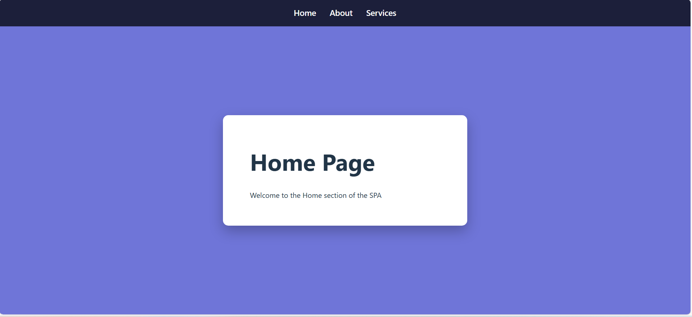
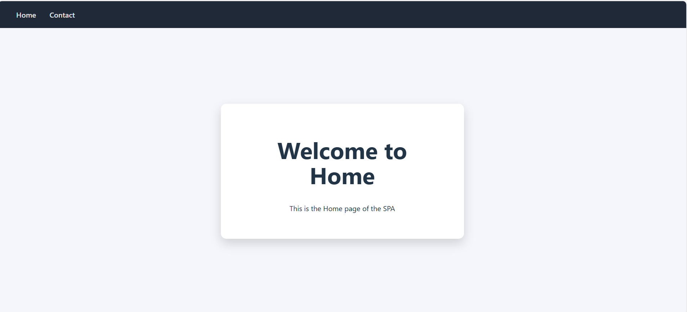
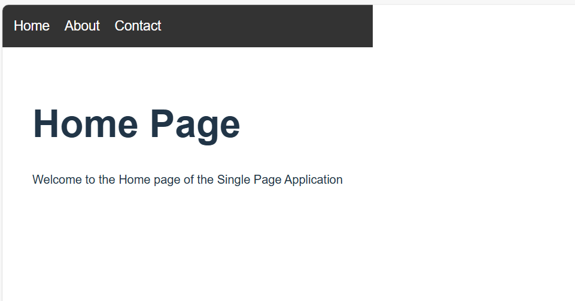

To create a multi-page Single Page Application (SPA) using client-side routing in React and demonstrate navigation between multiple components without reloading the page.

🛠️ Software Requirements

Node.js

React

React Router DOM

Web Browser

Code Editor (VS Code)

📖 Description

This experiment demonstrates how React Router is used to implement client-side routing in a Single Page Application.
The experiment is divided into three sub-experiments, each building upon the previous one to show progressive understanding of routing concepts.

🔹 Sub-Experiment 3.1
Basic Client-Side Routing
🎯 Objective

To implement basic routing using BrowserRouter, Routes, and Route.

🧩 Description

Two components are created.

Each component is mapped to a route.

Navigation is tested by manually changing the URL.

🖼️ Screenshot

🔹 Sub-Experiment 3.2
Navigation Using Link Component
🎯 Objective

To implement navigation using the Link component.

🧩 Description

Navigation links are created using Link.

Page transitions occur without page reload.

Demonstrates smooth SPA navigation.

🖼️ Screenshot

🔹 Sub-Experiment 3.3
Multi-Page SPA Using Routing
🎯 Objective

To create a complete multi-page SPA layout using routing.

🧩 Description

Multiple components: Home, About, Services.

A navigation bar is implemented.

Each component is mapped to a route.

UI resembles a real multi-page website.

🖼️ Screenshot

