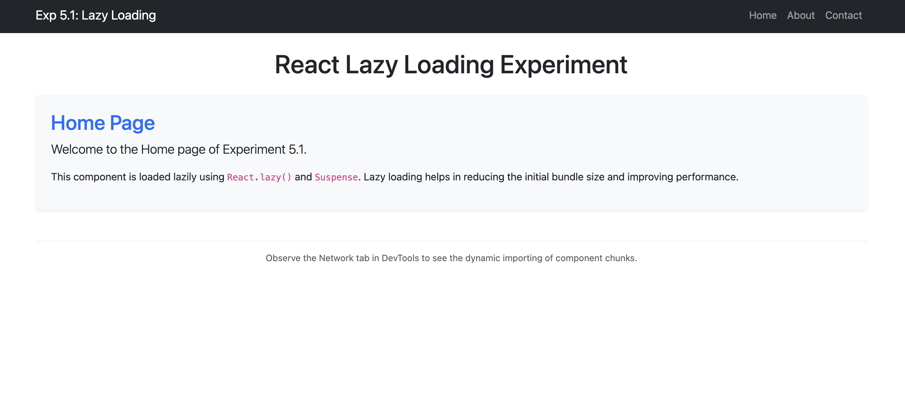
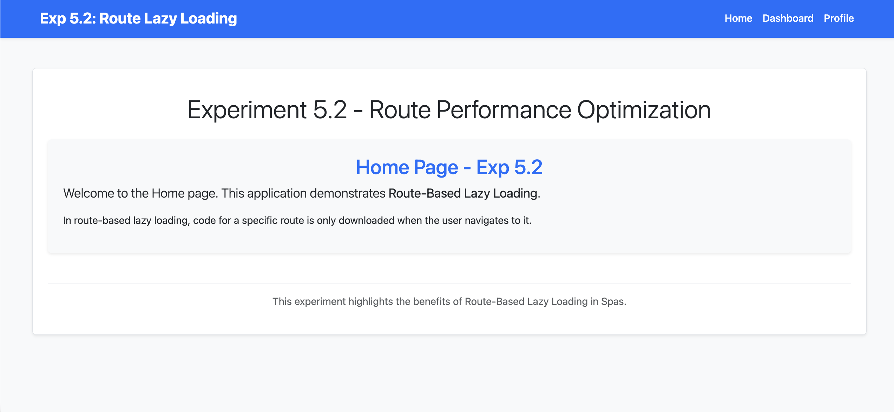

# Experiment 5: Optimized Frontend Performance Using Lazy Loading

## Overview

Unit-5 experiments demonstrating frontend performance optimization using lazy loading in Single Page Applications.

## Experiments

### 5.1 - Component Lazy Loading Using React.lazy and Suspense

Implementing lazy loading for multiple components to optimize bundle size.

### 5.2 - Route-Based Lazy Loading in SPA

Implementing route-based lazy loading to ensure route-specific components are loaded only when navigated to.

## Screenshots

Here are 4 screenshots demonstrating the lazy loading functionality:

1. 
2. 
3. 
4. 
