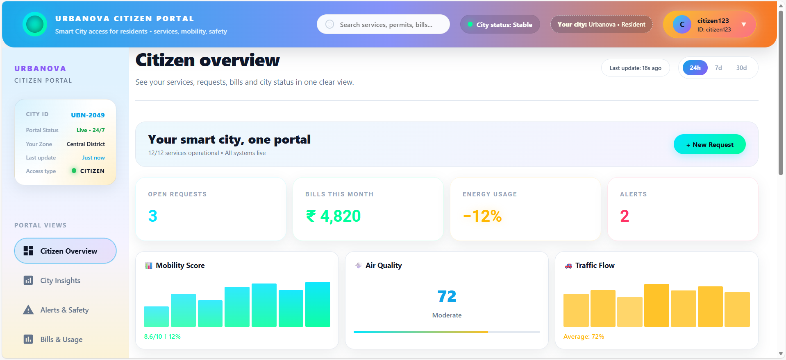

# 🏙️ Urbanova - Smart City Citizen Portal

A modern, responsive citizen portal for smart cities. Residents can access urban services, view real-time city insights, track bills, receive safety alerts, and manage their profiles.

## ✨ Key Features

- 🔐 **Secure Authentication** - Login with citizen ID and password
- 📊 **Dashboard** - Real-time metrics, alerts, and quick actions
- 📈 **City Analytics** - Traffic, air quality, mobility trends
- 🚨 **Alerts & Safety** - Active incidents and notifications
- 💳 **Bills & Usage** - Payment history and consumption tracking
- 🗺️ **Mobility Maps** - Traffic status and transit schedules
- ⚙️ **Profile Settings** - Account management and preferences

## 🛠️ Tech Stack

- **React 18** with Hooks
- **Vite** - Fast build tool
- **Recharts** - Data visualization
- **Material-UI Icons** - Icon library
- **React Bootstrap** - Responsive grid
- **CSS-in-JS** - Modern styling

## 📱 Screenshots

### Login Page


### Dashboard Overview



### Sidebar Navigation


### Profile & Settings


## 🚀 Quick Start

```bash
# Install dependencies
npm install

# Start dev server
npm run dev

# Build for production
npm run build
```

App runs at `http://localhost:5173`

## 📱 Portal Views

| View                   | Description                                 |
| ---------------------- | ------------------------------------------- |
| **Citizen Overview**   | Main dashboard with metrics, charts, alerts |
| **City Insights**      | Analytics and city trends                   |
| **Alerts & Safety**    | Active incidents and notifications          |
| **Bills & Usage**      | Payment tracking and consumption            |
| **Mobility & Maps**    | Traffic and transit status                  |
| **Profile & Settings** | Account management                          |

## 🎨 Design Highlights

- Modern gradient UI with smooth animations
- Responsive layout for all devices
- Large, readable text (14px+)
- Color-coded status indicators
- Interactive modal popups
- Clean, spacious design

## 📄 License

MIT License - See LICENSE file for details

## 👥 Author

Prince Jangra

---

**Urbanova Smart City Portal** - Empowering Citizens, One Portal at a Time 🏙️✨
